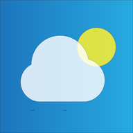
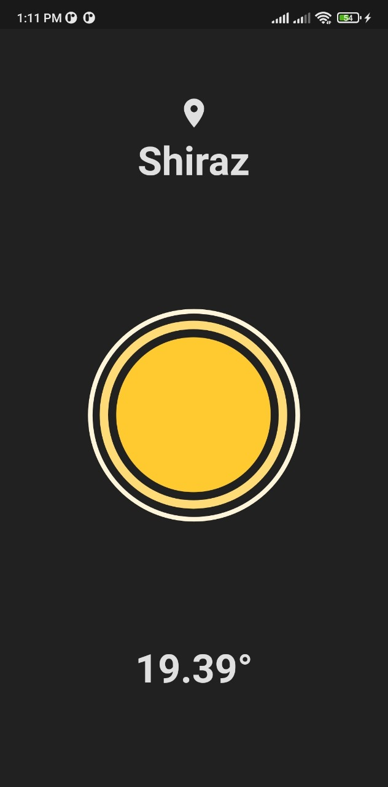
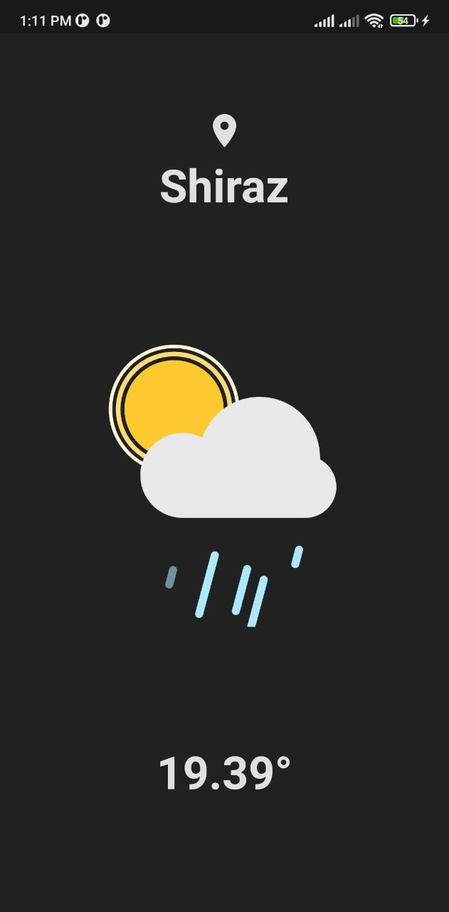
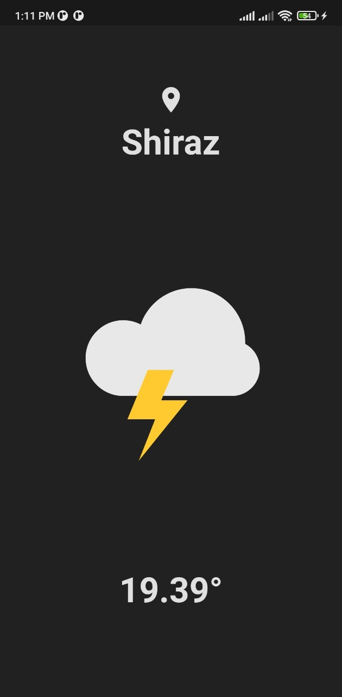

# **Weather App**  

  
## 📸 ScreenShots
 
| --------------------------------- |
|   |
|   |
|   |

## 🔌 Plugins

| Name                                                                   |
| ---------------------------------------------------------------------- |
| [**geolocator**](https://pub.dev/packages/geolocator)        |
| [**http**](https://pub.dev/packages/http)  |
| [**permission_handler**](https://pub.dev/packages/permission_handler)                  |
| [**lottie**](https://pub.dev/packages/lottie)                  |
| [**get**](https://pub.dev/packages/get)                  |

 # <em>Version : 1.0 <em/> 
